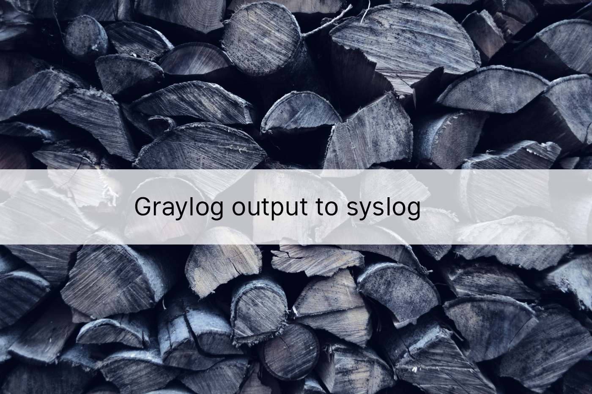
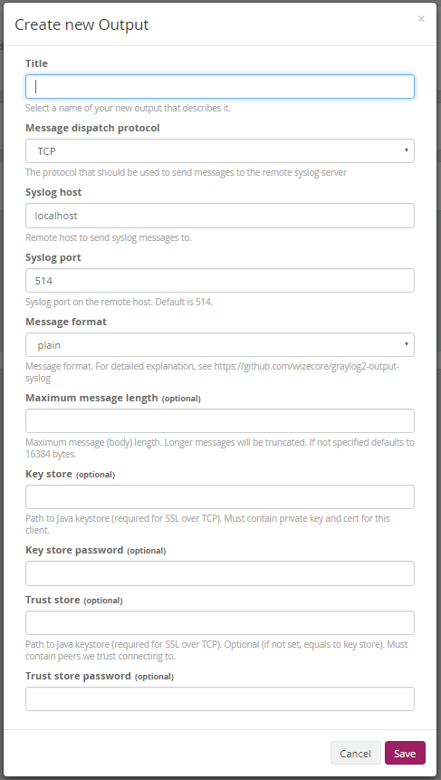

# 

Based on the syslog4j library bundled with Graylog.

This plugin allows you to forward messages from a Graylog 2.X server in syslog format. Messages can be dispatched over TCP or UDP and formatted as plain text (classic), structured syslog (rfc 5424) or CEF (experimental).

This plugin supports Graylog 2.4.x, 2.5.x, 3.0.0. Other releases might work, pls try to use latest plugin.

## Graylog marketplace

This plugin is also published on graylog marketplace.

https://marketplace.graylog.org/addons/8eb67dc0-b855-455c-a37f-0fa8ae522854

## How to build

This project is using Maven and requires Java 8 or higher.

You can build a plugin (JAR) with `mvn package`.

## How to use

- Download `graylog2-output-syslog-VERSION.jar` from releases and put inside plugins folder
- Restart Graylog server
- Create a new output globally or attached to a stream.

## Configuration

- _Message dispatch protocol_: Select tcp or udp
- _Syslog host_: Hostname of the remote syslog serevr
- _Syslog port_: Syslog receiver port on remote host, usually 514
- _Format_: Specify one of plain, structured, full, cef or custom:FQCN (see below for explanation on values)



## Supported formats

### plain

Standard plain syslog format. Minimal information.
Example:

```
<14>Mar 31 19:19:02 nginx runit-service -  GET /test1/x HTTP/1.1
```

### structured

Based on rfc5424. Sends all fields + log message.
Example:

```
<14>1 2016-03-31T19:31:46.358Z graylog unknown - nginx [all@0 request_verb="GET" remote_addr="192.168.1.37" response_status="404" from_nginx="true" level="6" connection_requests="1" http_version="1.1" response_bytes="1906" source="nginx" message="GET /test1/2 HTTP/1.1" gl2_source_input="566c96abe4b094dfbc2661a8" version="1.1" nginx_access="true" http_user_agent="Wget/1.15 (linux-gnu)" remote_user="-" connection_id="1755" http_referer="-" request_path="/test1/2" gl2_source_node="bebd092c-85d7-49a3-8188-f7af734747fb" _id="34cb0f40-f777-11e5-b30c-0800276c97db" millis="0.002" facility="runit-service" timestamp="2016-03-31T19:31:46.000Z"] GET /test1/2 HTTP/1.1
```

### cef

Common event format aka HP ArcSight format. For this format to work you must set ARCSight port which expects CEF messages without syslog header. Also read CEF format handling below.

### full

A variation of structured format except full message is added.
Example:

```
<14>1 2016-03-31T19:19:02.524Z graylog unknown - nginx [all@0 request_verb="GET" remote_addr="192.168.1.37" response_status="404" from_nginx="true" level="6" connection_requests="1" http_version="1.1" response_bytes="1906" source="nginx" message="GET /test1/x HTTP/1.1" gl2_source_input="566c96abe4b094dfbc2661a8" version="1.1" nginx_access="true" http_user_agent="Wget/1.15 (linux-gnu)" remote_user="-" connection_id="970" http_referer="-" request_path="/test1/x" gl2_source_node="bebd092c-85d7-49a3-8188-f7af734747fb" _id="6d833da0-f775-11e5-b30c-0800276c97db" millis="0.002" facility="runit-service" timestamp="2016-03-31T19:19:02.000Z"] source: nginx | message: GET /test1/x HTTP/1.1 { request_verb: GET | remote_addr: 192.168.1.37 | response_status: 404 | from_nginx: true | level: 6 | connection_requests: 1 | http_version: 1.1 | response_bytes: 1906 | gl2_source_input: 566c96abe4b094dfbc2661a8 | version: 1.1 | nginx_access: true | http_user_agent: Wget/1.15 (linux-gnu) | remote_user: - | connection_id: 970 | http_referer: - | request_path: /test1/x | gl2_source_node: bebd092c-85d7-49a3-8188-f7af734747fb | _id: 6d833da0-f775-11e5-b30c-0800276c97db | millis: 0.002 | facility: runit-service | timestamp: 2016-03-31T19:19:02.000Z }
```

### trasparent

A variation of plain sender which tries to keep facility and source from fields, resulting in having a passthrough effect with Graylog Syslog input.
If configured, can omit header if your message already contains header.

Example:

```
<14>Feb 11 17:32:06 graylog01 sshd[26524]: Failed password for admin7 from 10.128.230.28 port 58363 ssh2
```

To test, configure Syslog input and send to it using netcat:

```
echo "<86>_sourcehost_ messagetext86" | nc -v -w 0 localhost 1514
```

### snare

Re-build a snare log format of windows event in stream.
Example:

```
<14>Feb 11 17:32:26 graylog01 MSWinEventLog	1	Security	65493	Mon Feb 11 17:32:26 2019	4726	Microsoft-Windows-Security-Auditing	N/A	N/A	AUDIT_SUCCESS	WIN-8F8OSAB5AMC.testwin.lan	User Account Management		A user account was deleted.  Subject:  Security ID:  S-1-5-21-2081084977-3747244460-254679223-500  Account Name:  Administrator  Account Domain:  TESTWIN  Logon ID:  0x5F1B5  Target Account:  Security ID:  S-1-5-21-2081084977-3747244460-254679223-1126  Account Name:  admintest  Account Domain:  TESTWIN  Additional Information:  Privileges -	65493
```

### custom:FQCN

Specify your implementation of com.wizecore.graylog2.plugin.MessageSender interface.

## CEF format handling

There are format for CEF message delivery used in this plugin. For more information, consult ArcSight [Common Event Format Guide](https://community.saas.hpe.com/t5/ArcSight-Connectors/ArcSight-Common-Event-Format-CEF-Guide/ta-p/1589306)

### Header

Plugin outputs CEF Header with following fields: `CEF:0|Graylog|graylog-output-syslog:cefsender|2.3.1|`

### Device Event Class ID field

Currently it is hardcoded as `log:1`

### Name field

- If message contains `act` field then it is used
- If message contains `short_message` field then it is used
- else Graylog messageId is used for Name field

New lines are stripped from this field. Proper escaping applied.

### Severity field

Mapping performed between syslog level and CEF log level.

| Syslog    | CEF |
| --------- | --- |
| DEBUG     | 1   |
| NOTICE    | 2   |
| INFO      | 3   |
| WARN      | 6   |
| ERROR     | 7   |
| CRITICAL  | 8   |
| ALERT     | 9   |
| EMERGENCY | 10  |

### Extension fields

Every existing message fields is written to Extension except `message`, `full_message` and `short_message`

### Automatically generated extension fields

If existing fields does not contain such keys, following fields will be added to extension:

| CEF Key Name | Source                                       |
| ------------ | -------------------------------------------- |
| start        | Message timestamp, unix time in milliseconds |
| msg          | Message text (`message`)                     |
| externalId   | Message ID (assigned by Graylog)             |

## Links

- https://tools.ietf.org/html/rfc5424
- https://github.com/Graylog2
- http://blog.rootshell.be/2011/05/11/ossec-speaks-arcsight/
- https://groups.google.com/forum/#!topic/ossec-list/3guXmHJYHtY
- http://habrahabr.ru/post/151631/
- http://www.syslog4j.org/
- https://www.graylog.org/resources/gelf-2/
- http://docs.graylog.org/en/1.0/pages/plugins.html
- https://community.saas.hpe.com/t5/ArcSight-Connectors/ArcSight-Common-Event-Format-CEF-Guide/ta-p/1589306
- https://success.trendmicro.com/solution/TP000086250-What-are-Syslog-Facilities-and-Levels

